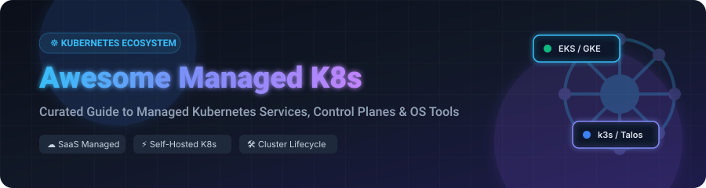

# ☸️ Awesome Managed Kubernetes Service (K8s)

  
  
  
  
  

## 📌 Top Managed Kubernetes Service (K8s) Ecosystem & Tools

> **A curated collection of commercial Managed Kubernetes Services (SaaS/Hosted Platforms), Open-Source Kubernetes Distributions, Multi-Cluster Management Platforms, and Developer Tooling.**

**Last updated: October 2026**

---

## 🔍 Overview & Market Context

This repository tracks notable **commercial managed Kubernetes services** and **open-source projects** that provision, operate, scale, and simplify Kubernetes clusters — from cloud-managed control planes (EKS, GKE, AKS) to lightweight distributions (k3s, k0s, Talos Linux) and multi-cluster lifecycle platforms (Rancher, Cluster API, vCluster).

Whether you are building platform engineering pipelines, choosing a cloud provider for containerized microservices, or operating on-premises Kubernetes, this list provides transparent comparisons of pricing, free tiers, scale, and star popularity.

---

## 📑 Table of Contents

- [☁️ Commercial SaaS / Hosted Managed K8s Platforms](#️-commercial-saas--hosted-managed-k8s-platforms)
- [📦 Open-Source GitHub Projects](#-open-source-github-projects)
  - [☸️ Core Distributions & Bootstrapping](#️-core-distributions--bootstrapping)
  - [🎛️ Cluster Management & Multi-Cluster Platforms](#️-cluster-management--multi-cluster-platforms)
  - [💻 Developer Workflows & Inner-Loop Tools](#-developer-workflows--inner-loop-tools)
  - [🖥️ Cluster Dashboards & Interfaces (TUI/GUI)](#️-cluster-dashboards--interfaces-tuigui)
- [🤝 How to Contribute](#-how-to-contribute)
- [⚖️ Disclaimer & Guidance](#️-disclaimer--guidance)
- [💖 Support & Sponsorship](#-support--sponsorship)
- [⭐ Star History](#-star-history)

---

## ☁️ Commercial SaaS / Hosted Managed K8s Platforms

> 📈 **Market Size & Sector Concentration**:  
> The global Managed Kubernetes & Container Management Service sector is estimated at **$7.2 Billion in 2026** and projected to reach **$18.5 Billion by 2030** (CAGR ~26.4%). The market is **concentrated at the top hyperscaler tier** (AWS EKS, Google GKE, and Azure AKS command over ~70% market share), while remaining **moderately fragmented across alternative cloud providers and specialized enterprise management platforms** (DigitalOcean, Linode/Akamai, Scaleway, Civo, Vultr, and Red Hat OpenShift).

The table below lists top managed Kubernetes providers, **sorted in descending order by parent company scale / market valuation**:

| 🚀 SaaS Platform | 🏢 Company Scale / Valuation | 💰 Specific Starting Pricing | 🎁 Specific Free Tier / Trial Limits | 💡 Key Focus & Best For |
| :--- | :--- | :--- | :--- | :--- |
| **[Azure Kubernetes Service (AKS)](https://azure.microsoft.com/en-us/products/kubernetes-service/)** | **Microsoft** (~$3.1 Trillion Market Cap / $245B Rev) | **$0.00/hr** Free control plane (Standard tier); worker nodes start at ~$0.007/hr ($5/mo) | **30-day free trial with $200 Azure credit** + 12 months of popular free services | Microsoft ecosystem integration, Enterprise Azure AD security & governance |
| **[Google Kubernetes Engine (GKE)](https://cloud.google.com/kubernetes-engine)** | **Alphabet / Google** (~$2.1 Trillion Market Cap / $307B Rev) | **$0.10/hr** per cluster control plane (~$73/mo); Autopilot $0.0000348/vCPU-hr | **$74.40 monthly credit** (1 free zonal control plane/mo) + **$300 free trial credit for 90 days** | Original managed K8s pioneer, GKE Autopilot hands-free node management |
| **[Amazon EKS](https://aws.amazon.com/eks/)** | **Amazon AWS** (~$2.0 Trillion Market Cap / $575B Rev) | **$0.10/hr** per cluster control plane (~$73/mo); EC2 nodes from $0.0042/hr | **$300 promotional AWS credits** for 60 days via Startups/Free Tier + 12 mo free EC2 750 hrs/mo | AWS-native workloads, EKS Auto Mode & deep IAM/VPC/Fargate integration |
| **[Red Hat OpenShift (ROSA)](https://www.redhat.com/en/technologies/cloud-computing/openshift)** | **Red Hat / IBM** (~$210 Billion Market Cap / $62B Rev) | **$0.03/vCPU-hr** (~$0.171/cluster-hr control plane fee on ROSA) | **60-day enterprise free trial** for ROSA (AWS) & OpenShift Dedicated | Enterprise-grade turnkey Kubernetes platform with built-in CI/CD & security |
| **[Scaleway Kubernetes Kapsule](https://www.scaleway.com/en/kubernetes-kapsule/)** | **Scaleway / iliad SA** (~$10 Billion Market Cap / $10B Rev) | **€0.00/hr** control plane (100% free control plane); worker nodes from €0.01/hr (~€7/mo) | **€100 free cloud credits valid for 30 days** for new accounts | European cloud sovereign data storage, GDPR compliance & cost efficiency |
| **[Linode Kubernetes Engine (LKE)](https://www.linode.com/products/kubernetes/)** | **Linode / Akamai** (~$15 Billion Market Cap / $3.8B Rev) | **$0.00/hr** control plane (100% free control plane); compute nodes from $5/mo ($0.0075/hr) | **$100 free cloud credits valid for 60 days** for new users | Cost-conscious cloud deployments, simple predictable node pricing |
| **[DigitalOcean Kubernetes (DOKS)](https://www.digitalocean.com/products/kubernetes/)** | **DigitalOcean** (~$3.5 Billion Market Cap / $720M Rev) | **$0.00/hr** control plane (free for clusters with 1+ nodes); nodes start at $12/mo ($0.018/hr) | **$200 free cloud credits valid for 60 days** for new signups | Developer-friendly UI, quick 3-minute provisioning, startups & indie dev |
| **[Rancher Cloud / Prime](https://www.rancher.com/)** | **SUSE / Rancher** (~$2.5 Billion Valuation / $650M Rev) | Enterprise subscriptions start at **$1,000/node/year** (Open-source core is free) | **30-day enterprise free trial** for Rancher Prime (100% free self-hosted open-source) | Multi-cloud & multi-cluster governance, unified single-pane-of-glass management |
| **[Vultr Managed Kubernetes (VKE)](https://www.vultr.com/kubernetes/)** | **Vultr** (~$1.2 Billion Valuation / $200M Rev) | **$0.00/hr** control plane (100% free control plane); compute nodes from $10/mo ($0.015/hr) | **$250 free cloud credits valid for 30 days** for new signups | Global presence across 32+ data centers, low-latency edge deployments |
| **[Civo Kubernetes](https://www.civo.com/)** | **Civo** (~$100 Million Valuation / $20M Rev) | **$0.00/hr** control plane; K3s worker nodes start at **$4.95/mo** ($0.007/hr) | **$250 free cloud credits valid for 30 days** for developers | Ultra-fast sub-90-second cluster spin-up, lightweight K3s cloud engine |

---

## 📦 Open-Source GitHub Projects

Below is a comprehensive list of top open-source projects for running, managing, and developing on Kubernetes, **sorted in descending order by GitHub star count**:

### ☸️ Core Distributions & Bootstrapping

- **[Kubernetes](https://github.com/kubernetes/kubernetes)**   
  **The de facto standard for container orchestration** — Apache-2.0 licensed. The production foundation for all cloud container infrastructure with declarative API controllers and extensibility.

- **[Minikube](https://github.com/kubernetes/minikube)**   
  **Local Kubernetes engine for local development** — Apache-2.0 licensed. Runs single-node Kubernetes clusters inside VMs or Docker containers on macOS, Linux, and Windows.

- **[k3s](https://github.com/k3s-io/k3s)**   
  **Lightweight CNCF-certified Kubernetes distribution** — Apache-2.0 licensed. Packaged as a single binary under 100MB, optimized for edge, IoT, ARM, and low-resource environments.

- **[Talos Linux](https://github.com/siderolabs/talos)**   
  **Kubernetes-native, immutable OS** — MPL-2.0 licensed. API-driven Linux distribution designed exclusively for Kubernetes, with no SSH or console access for maximum security.

- **[Kops (Kubernetes Operations)](https://github.com/kubernetes/kops)**   
  **Production cluster provisioning for AWS & GCE** — Apache-2.0 licensed. Automated cluster lifecycle tool featuring declarative state storage (S3) and terraform generation.

- **[k0s](https://github.com/k0sproject/k0s)**   
  **Zero-friction single-binary Kubernetes** — Apache-2.0 licensed. Zero-dependency distribution that runs on any Linux host, reducing cluster setup overhead to a single command.

- **[Kind (Kubernetes IN Docker)](https://github.com/kubernetes-sigs/kind)**   
  **Runs Kubernetes clusters inside Docker containers** — Apache-2.0 licensed. Primarily targeted at testing Kubernetes itself and inner-loop CI integration.

- **[MicroK8s](https://github.com/canonical/microk8s)**   
  **Canonical's zero-ops, lightweight Kubernetes** — Apache-2.0 licensed. Single-command snap package install with automatic security updates and built-in addon toggles.

- **[K3sup](https://github.com/alexellis/k3sup)**   
  **Bootstrap k3s over SSH in seconds** — MIT licensed. Lightweight CLI tool that converts any local or remote VM into a k3s cluster with zero dependencies.

---

### 🎛️ Cluster Management & Multi-Cluster Platforms

- **[Rancher](https://github.com/rancher/rancher)**   
  **Complete enterprise multi-cluster management platform** — Apache-2.0 licensed. Centralized web UI to provision, secure, and manage Kubernetes clusters across any cloud or data center.

- **[Kubespray](https://github.com/kubernetes-sigs/kubespray)**   
  **Ansible-based production Kubernetes deployment** — Apache-2.0 licensed. Flexible playbooks for deploying highly available, production-grade Kubernetes on bare-metal and private clouds.

- **[vCluster](https://github.com/loft-sh/vcluster)**   
  **Virtual Kubernetes clusters inside host clusters** — Apache-2.0 licensed. Lightweight virtual control planes running within namespace worker nodes for multi-tenant isolation.

- **[Cluster API](https://github.com/kubernetes-sigs/cluster-api)**   
  **Declarative cluster lifecycle management API** — Apache-2.0 licensed. Subproject extending Kubernetes CRDs to manage infrastructure provisioning across AWS, Azure, GCP, and vSphere.

- **[OKD](https://github.com/okd-project/okd)**   
  **The open-source community distribution of Red Hat OpenShift** — Apache-2.0 licensed. Extends Kubernetes with developer-centric builds, serverless engines, and web console.

- **[Kubefirst](https://github.com/kubefirst/kubefirst)**   
  **Instant GitOps platform for Kubernetes** — Apache-2.0 licensed. Fully automated cloud-native stack integrating Vault, Argo CD, Terraform, and GitHub/GitLab.

- **[Kamaji](https://github.com/clastix/kamaji)**   
  **Managed Kubernetes control planes in K8s** — Apache-2.0 licensed. Turns containerized control plane pods into managed tenant clusters, drastically lowering infrastructure overhead.

- **[K0smotron](https://github.com/k0sproject/k0smotron)**   
  **Manage k0s control planes as Kubernetes pods** — Apache-2.0 licensed. Operates control plane instances inside existing clusters for simplified edge node management.

- **[Kubermatic Kubernetes Platform](https://github.com/kubermatic/kubermatic)**   
  **Enterprise multi-cloud cluster automation platform** — Apache-2.0 licensed. Automates thousands of Kubernetes cluster operations from a central control plane.

---

### 💻 Developer Workflows & Inner-Loop Tools

- **[Skaffold](https://github.com/GoogleContainerTools/skaffold)**   
  **Easy and repeatable Kubernetes development** — Apache-2.0 licensed. Google's tool handling the workflow for building, pushing, and deploying applications continuously to K8s.

- **[Tilt](https://github.com/tilt-dev/tilt)**   
  **Microservice development environment for K8s** — Apache-2.0 licensed. Automates live updates and provides a customized dev dashboard for local multi-service testing.

- **[DevSpace](https://github.com/devspace-sh/devspace)**   
  **Client-only CLI tool for Kubernetes developers** — Apache-2.0 licensed. Direct hot-reloading into containers, live debugging, and deployment automation.

- **[Garden](https://github.com/garden-io/garden)**   
  **Graph-based development and testing environment** — Apache-2.0 licensed. Sped up integration testing and development workflows by sharing build and test caches across teams.

---

### 🖥️ Cluster Dashboards & Interfaces (TUI/GUI)

- **[K9s](https://github.com/derailed/k9s)**   
  **Terminal UI for managing Kubernetes clusters** — Apache-2.0 licensed. Powerful real-time CLI dashboard for viewing metrics, managing resources, logs, and shell sessions.

- **[Lens](https://github.com/lensapp/lens)**   
  **The Kubernetes IDE for desktop** — MIT licensed. Visual desktop application providing real-time multi-cluster observation, node monitoring, and log streams.

- **[Kubernetes Dashboard](https://github.com/kubernetes/dashboard)**   
  **Official general-purpose web UI for Kubernetes** — Apache-2.0 licensed. Allows users to manage applications running in the cluster and troubleshoot containerized workloads.

- **[Headlamp](https://github.com/headlamp-k8s/headlamp)**   
  **User-friendly, extensible CNCF Kubernetes UI** — Apache-2.0 licensed. Modern web UI designed for both in-cluster and desktop execution with plugin system.

---

## 🤝 How to Contribute

Contributions are welcome! If you know of a managed Kubernetes service or open-source tool that should be included:

1. **Fork** this repository.
2. Add or update entries in `README.md` keeping formatting consistent.
3. Ensure pricing, free tiers, and star counts are accurate and verifiable.
4. Submit a **Pull Request** with a brief summary of additions.

See our curated list collection at [Awesome-Awesome-Awesome](https://github.com/ishandutta2007/Awesome-Awesome-Awesome).

---

## ⚖️ Disclaimer & Guidance

- **Community Curated**: This repository is community-maintained and does not constitute formal endorsement.
- **Security & Maintenance**: Running production Kubernetes control planes requires etcd backups, rolling upgrade planning, and RBAC governance.
- **Licensing**: Always review project licenses (Apache-2.0, MPL-2.0, MIT) for commercial deployment compliance.

---

## 💖 Support & Sponsorship

Thank you for visiting this repository! If you find this curated list of Managed Kubernetes Services and Open-Source tools helpful in your platform engineering or DevOps journey, please consider supporting the project:

- ⭐ **Star this repository** on GitHub to help others discover it.
- 🔀 **Fork & Share** it with your fellow platform engineers, DevOps teams, and cloud-native developers.
- ☕ **Buy me a coffee**: Support ongoing maintenance and research via the [GitHub Sponsor Dashboard](https://github.com/sponsors/ishandutta2007).

  

---

## ⭐ Star History

---

  <b>Made with ❤️ for Platform Engineers, DevOps Teams & Cloud-Native Developers</b>

